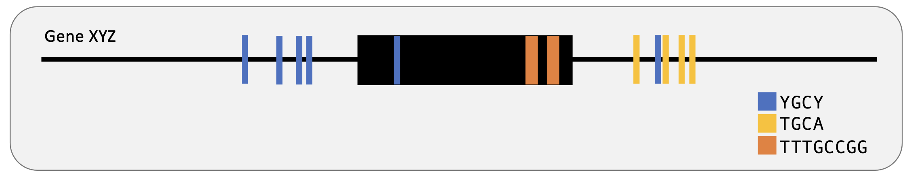

# motif mark

**The goal of this assignment is to develop a Python script to plot protein binding motifs on an image of an exon and flanking introns**

**input**: a fasta file contaning the DNA sequences (introns should be denoted in lower case and exons should be denoted in uppercase) and text file containing the motif sequences

**output**: a vector-based image (.png) that denotes introns and exons and can handle multiple motifs on multiple genes

## usage

```python ./motif-mark-oop.py -f <path-to-fasta-file> -m <path-to-motif-text> ```


## example


## script dependencies
 The only package needed is [Pycairo v.1.27.0](https://github.com/pygobject/pycairo) 